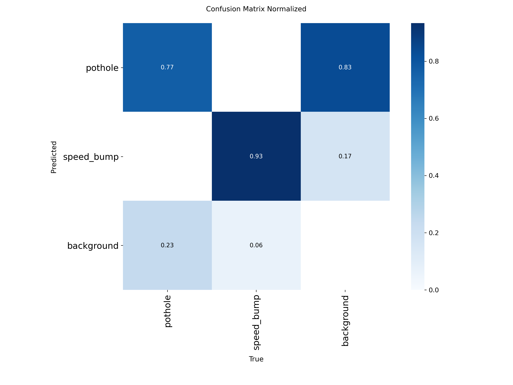

# ICVSP: Trust-Aware Cooperative Vehicle Safety Platform (prototype)

Graduation project, 2026–2027. A low-cost, retrofit in-vehicle unit that detects road hazards
(potholes, speed bumps), verifies them with on-board sensors and reports from other vehicles, and
warns approaching drivers. It keeps working when the cloud or network is unavailable.

This repository holds the two working prototypes:
- **`engine/`: the trust & consensus engine**, the decision layer and the core of the project. It decides, with a
  written reason, whether reported hazards are real enough to warn anyone, and who.
- **`ai/`: the camera-based hazard detector** that produces the reports.

## Current status

| Component | Status |
|---|---|
| Trust & consensus engine (schema checks, plausibility, trust, consensus, Sybil / replay defence, targeting) | ✅ Prototype, 39 tests, evaluated in simulation |
| Pothole / speed-bump detector (camera, YOLO11n) | ✅ Trained and evaluated on public data (v2: mAP50 0.837) |
| Egyptian road test set | 🟡 Clips being recorded by the team |
| IMU bump confirmation, V2V (ESP32), cloud, in-vehicle hardware | ⏳ Planned (see roadmap) |

## Engine: simulated results

2,000 simulated runs per setting against two baselines (B1: warn on any report; B2: majority vote).
Detector assumptions: 85 % hit rate, 5 % false-alarm rate. Weights and thresholds are untuned.

| Attackers (share of vehicles) | B1 false alerts | B2 false alerts | **Engine false alerts** | Engine accuracy |
|---|---|---|---|---|
| 20 %, new identities | 46.9 % | 24.3 % | **0.5 %** | 96.0 % |
| 30 %, new identities | 49.2 % | 41.6 % | **1.0 %** | 94.0 % |
| 30 %, established "insider" identities | 49.2 % | 41.6 % | **15.2 %** ✗ (target ≤ 10 %) | 76.5 % |

**Honest limits:** the engine fails its target against insiders with a good history (the open research problem we
are working on), and packet loss raises missed hazards. These are simulated results, not real traffic. Full tables,
charts and method: [`engine/results/summary.md`](engine/results/summary.md) and [`engine/README.md`](engine/README.md).

Run it (plain Python 3.10+, no dependencies): `cd engine && python3 -m icvsp.demo all` for the seven scenarios
(single report, duplicates, false report, Sybil, cloud outage, replay, GPS spoofing), and `python3 -m unittest` for the tests.

## Detector: results on a public test set (1,104 unseen images)

YOLO11n trained on the public [SBP-YOLO dataset](https://github.com/chuanqi1997/SBP-YOLO) after near-duplicate removal.
Best accuracy: `v2_e150_960` (150 epochs, 960 px). `v1_e150` (640 px) is about 2.25× cheaper per frame; the in-vehicle speed benchmark decides which one runs on the unit. `v0_public_merge` (50 epochs) is the baseline.

| Class | v0 P / R (mAP50) | v1 P / R (mAP50) | **v2 P / R (mAP50)** |
|---|---|---|---|
| Speed bump | 0.89 / 0.86 (0.90) | 0.92 / 0.89 (0.93) | **0.90 / 0.90 (0.93)** |
| Pothole | 0.82 / 0.60 (0.69) | 0.83 / 0.65 (0.72) | **0.82 / 0.68 (0.75)** |
| **Overall mAP50** | 0.795 | 0.825 (+0.030) | **0.837** (+0.042) |

<p align="center"></p>

**What we learned**
- **Speed bumps** exceed our pre-set acceptance threshold (recall ≥ 0.75, precision ≥ 0.70) on public data; only 6 % are
  missed. Whether that holds on **Egyptian** roads is the open question; the Egyptian test set decides it.
- **Potholes** remain harder: 27 % are missed (mostly small, distant ones) and most false alarms are pothole-like patches or
  shadows. The two classes are never confused with each other. This supports confirming camera detections with the IMU and
  with reports from other vehicles rather than trusting the camera alone.
- **Longer training has reached its limit:** v1's best epoch was 139 of 150 and validation accuracy was nearly flat after
  epoch 100.
- **Larger images help small potholes, at a cost:** v2 (960 px) raises pothole recall from 0.65 to 0.68 and mAP50 from
  0.72 to 0.75, but needs about 2.25× the computation per frame. Speed bumps barely change.
- **Duplicates:** 676 near-duplicate images (9 %) were removed before training, including training images that duplicated
  test images, so our test numbers are not inflated by leakage.
- **Learning curve** (v0 setup): validation mAP50 0.695 → 0.744 → 0.764 → 0.784 at 25/50/75/100 % of the data.

The full experiment log, updated after every run, is in [`ai/results/experiments.md`](ai/results/experiments.md).

## Try it

- **Reproduce training:** [`ai/ICVSP_train_kaggle.ipynb`](ai/ICVSP_train_kaggle.ipynb) runs unattended on Kaggle (recommended for
  long runs); [`ai/ICVSP_train.ipynb`](ai/ICVSP_train.ipynb) is the interactive Google Colab version. Neither needs Google Drive
  access; both download the public dataset themselves.
- **Use the trained models:** [`ai/models/v2_e150_960.pt`](ai/models/v2_e150_960.pt) (most accurate; run with `--imgsz 960`) or
  [`ai/models/v1_e150.pt`](ai/models/v1_e150.pt) (faster), for example
  `python ai/scripts/predict_clips.py --weights ai/models/v1_e150.pt` on your own dash-cam clips.

Details, including how to record and label the Egyptian test set, are in [`ai/README.md`](ai/README.md).

## Repository layout

```
engine/
├── icvsp/              decision engine: validation, trust, consensus, risk, simulator, experiments
├── tests/              39 tests, including every scenario's expected outcome and cold start
├── schema/             Safety Event JSON schema
└── results/            Stage 2 experiment results and charts
ai/
├── ICVSP_train.ipynb   Colab notebook: download → merge → train → evaluate
├── scripts/            dataset download and merge, training, evaluation, clip check, experiment log
├── configs/            unified classes and dataset-specific mappings
├── models/             trained weights
├── results/            experiment log and confusion matrices per run
└── data/               (not versioned) datasets and team recordings
```

## Roadmap

1. Egyptian road test set and the "is public data enough?" decision
2. IMU-based bump and crash detection; camera + IMU fusion
3. Engine: low-density (1–2 user) and insider-attack improvements; burst packet loss; authenticated senders
4. Vehicle-to-vehicle messaging over ESP32 (ESP-NOW) and cloud synchronisation (AWS IoT)
5. In-vehicle unit (Raspberry Pi 5 + Hailo) and two-car demonstration

## Credits and licences

- Dataset: C. Liang et al., "SBP-YOLO: a lightweight real-time model for detecting speed bumps and potholes
  toward intelligent vehicle suspension systems", *J. Real-Time Image Processing* 23, 52 (2026). Not
  redistributed here; downloaded from the authors' public folder.
- Detector: [Ultralytics YOLO](https://github.com/ultralytics/ultralytics) (AGPL-3.0).
