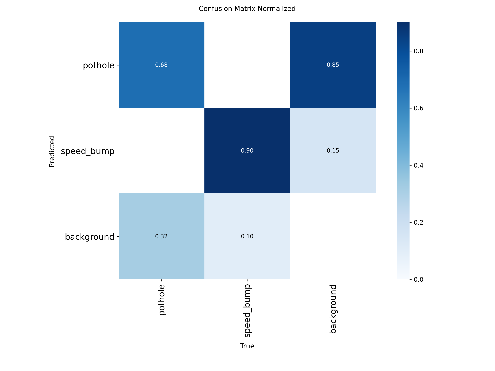

# ICVSP: Trust-Aware Cooperative Vehicle Safety Platform (prototype)

Graduation project, 2026–2027. A low-cost, retrofit in-vehicle unit that detects road hazards
(potholes, speed bumps), verifies them with on-board sensors and reports from other vehicles, and
warns approaching drivers. It keeps working when the cloud or network is unavailable.

This repository holds the **first working prototype: the camera-based hazard detector**.

## Current status

| Component | Status |
|---|---|
| Pothole / speed-bump detector (camera, YOLO11n) | ✅ Baseline trained and evaluated on public data |
| Egyptian road test set | 🟡 Clips being recorded by the team |
| IMU bump confirmation, trust & consensus engine, V2V (ESP32), cloud | ⏳ Planned (see roadmap) |

## First results: public test set (1,104 unseen images)

Baseline `v0_public_merge`: YOLO11n, 50 epochs, 640 px, trained on the public
[SBP-YOLO dataset](https://github.com/chuanqi1997/SBP-YOLO) after near-duplicate removal.

| Class | Precision | Recall | mAP50 |
|---|---|---|---|
| Speed bump | 0.89 | 0.86 | 0.90 |
| Pothole | 0.82 | 0.60 | 0.69 |
| **Overall** | | | **0.795** |

<p align="center"></p>

**What we learned**
- **Speed bumps** already exceed our pre-set acceptance threshold (recall ≥ 0.75, precision ≥ 0.70) on
  public data. Whether that holds on **Egyptian** roads is the open question; the Egyptian test set decides it.
- **Potholes** are harder: most misses are small, distant potholes, and most false alarms are pothole-like
  patches or shadows. The two classes are never confused with each other. This supports the design choice
  to confirm camera detections with the IMU and with reports from other vehicles, rather than trusting the camera alone.
- **Duplicates:** 676 near-duplicate images (9%) were removed before training, including training images
  that duplicated test images, so our test numbers are not inflated by leakage.
- **Learning curve:** validation mAP50 rose 0.695 → 0.744 → 0.764 → 0.784 at 25/50/75/100% of the data, and
  the model was still improving at the last epoch. Longer training (150 epochs) and larger input images
  (960 px) are the next experiments.

The full experiment log, updated after every run, is in [`ai/results/experiments.md`](ai/results/experiments.md).

## Try it

- **Reproduce training:** open [`ai/ICVSP_train.ipynb`](ai/ICVSP_train.ipynb) in
  [Google Colab](https://colab.research.google.com) (free T4 GPU). It needs no Google Drive access and
  downloads the public dataset itself.
- **Use the trained model:** [`ai/models/v0_public_merge.pt`](ai/models/v0_public_merge.pt), for example
  `python ai/scripts/predict_clips.py --weights ai/models/v0_public_merge.pt` on your own dash-cam clips.

Details, including how to record and label the Egyptian test set, are in [`ai/README.md`](ai/README.md).

## Repository layout

```
ai/
├── ICVSP_train.ipynb   Colab notebook: download → merge → train → evaluate
├── scripts/            dataset download and merge, training, evaluation, clip check, experiment log
├── configs/            unified classes and dataset-specific mappings
├── models/             trained weights
├── results/            experiment log and confusion matrices per run
└── data/               (not versioned) datasets and team recordings
```

## Roadmap

1. Egyptian road test set and the "is public data enough?" decision
2. IMU-based bump and crash detection; camera + IMU fusion
3. Trust and consensus engine, evaluated in simulation (false reports, GPS spoofing, Sybil identities)
4. Vehicle-to-vehicle messaging over ESP32 (ESP-NOW) and cloud synchronisation (AWS IoT)
5. In-vehicle unit (Raspberry Pi 5 + Hailo) and two-car demonstration

## Credits and licences

- Dataset: C. Liang et al., "SBP-YOLO: a lightweight real-time model for detecting speed bumps and potholes
  toward intelligent vehicle suspension systems", *J. Real-Time Image Processing* 23, 52 (2026). Not
  redistributed here; downloaded from the authors' public folder.
- Detector: [Ultralytics YOLO](https://github.com/ultralytics/ultralytics) (AGPL-3.0).
